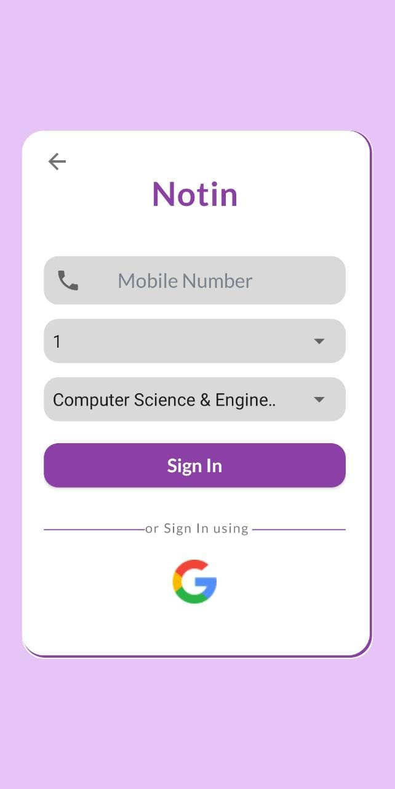
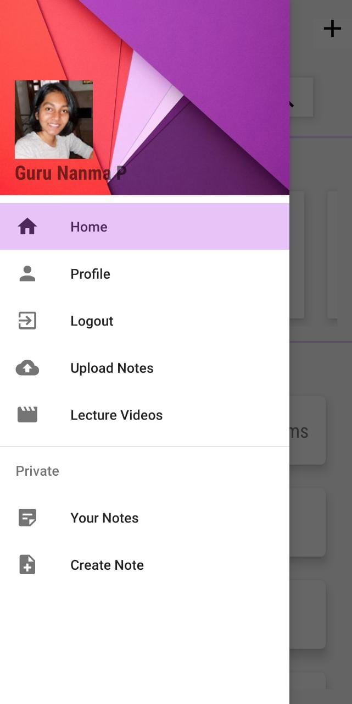
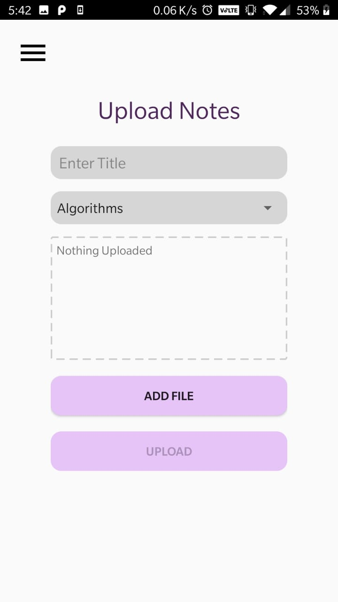

# Notin'

An app for sharing notes and reference materials as well as lecture videos.

### Features
<li>Create, view, upload and download notes and documents.</li>
<li>Speech to text conversion and Image text recognition to take down notes efficiently.</li>
<li>View Lecture videos uploaded by faculty.</li>

### Technologies
<li>Android Studio</li>
<li>Firebase</li>
<li>Room(local database)</li>

### Screen Shots
## <li>Splash Screen</li>

------------------------------------------------------------------------------------------------------------------
------------------------------------------------------------------------------------------------------------------

## <li>Onboarding Screens</li>
<table>
  <tr>
    <td>Onboarding Screen - Student</td>
     <td>Onboarding Screen - Teacher</td>
  </tr>
  <tr>
    <td></td>
    <td></td>
  </tr>
 </table>

------------------------------------------------------------------------------------------------------------------
------------------------------------------------------------------------------------------------------------------

## <li>Login Screen</li>

------------------------------------------------------------------------------------------------------------------
------------------------------------------------------------------------------------------------------------------

## <li>Home Screen</li>

------------------------------------------------------------------------------------------------------------------
------------------------------------------------------------------------------------------------------------------

## <li>Private Notes</li>

------------------------------------------------------------------------------------------------------------------
------------------------------------------------------------------------------------------------------------------

## <li>Create Notes</li>

------------------------------------------------------------------------------------------------------------------
------------------------------------------------------------------------------------------------------------------

## <li>Navigation Menu</li>

------------------------------------------------------------------------------------------------------------------
------------------------------------------------------------------------------------------------------------------

## <li>Upload Notes</li>

------------------------------------------------------------------------------------------------------------------
------------------------------------------------------------------------------------------------------------------

## <li>Update Profile</li>

------------------------------------------------------------------------------------------------------------------
------------------------------------------------------------------------------------------------------------------

## <li>Upload Videos</li>

------------------------------------------------------------------------------------------------------------------
------------------------------------------------------------------------------------------------------------------
